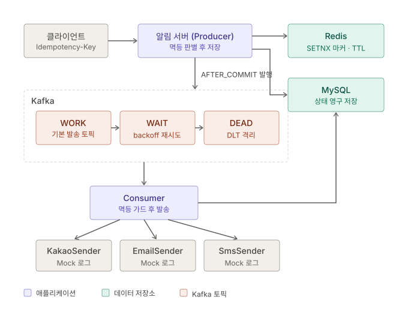

# 알림 발송 시스템

클라이언트의 알림 등록 요청을 받아 **Kafka 기반 비동기 파이프라인**으로 채널별(카카오톡/이메일/SMS) 발송.
발송은 Mock(콘솔 로그)이며, **멱등성(Redis + DB)** 과 **재시도/DLT(Kafka)** 로 중복·장애를 다룬다.

- Java 17 / Spring Boot 3.5 / Gradle
- MySQL (상태 영구 저장) · Redis(Redisson) (멱등성 판별) · Kafka (비동기 발송 + 재시도/DLT)

---

## 1. 요구사항 분석

### 기능 요구사항
- 알림 등록 API — `POST /notifications`
- 알림 상태 조회 — `GET /notifications/{id}`
- Kafka Producer / Consumer 연동
- 채널별 발송(카카오톡/이메일/SMS), 발송은 Mock = 콘솔 로그
- 알림 상태(PENDING/SENT/FAILED)를 DB에 저장

### 비기능 요구사항 (발굴)
| 문제 | 해결 전략 |
|------|-----------|
| **중복 발송** | 멱등성 키(클라이언트 제공) + Redis `SETNX` 판별 + DB 유니크 백스톱 |
| **장애 내구성** | MQ(Kafka) 기반 비동기 + 재시도(WAIT) + 데드레터(DEAD) |
| **채널 확장성** | 전략 패턴(`NotificationSender` + Resolver) |
| **커밋/발행 정합성** | 트랜잭션 커밋 이후에만 Kafka 발행(AFTER_COMMIT) |

---

## 2. 아키텍처 다이어그램



### 패키지 구조
```
com.example.seunggu
├─ notification
│  ├─ controller/  NotificationController      (POST /notifications, GET /{id})
│  ├─ dto/         NotificationRequest, NotificationResponse
│  ├─ domain/      Notification(엔티티), NotificationStatus, NotificationChannel
│  ├─ repository/  NotificationRepository
│  ├─ service/     NotificationService(멱등 판별), NotificationRegistrar(트랜잭션 경계)
│  ├─ event/       NotificationRegisteredEvent
│  ├─ sender/      NotificationSender(전략), Kakao/Email/SmsSender
│  └─ kafka/       NotificationEventProducer, NotificationConsumer(+DLT)
└─ global
   ├─ config/      KafkaTopicConfig, AsyncConfig
   ├─ resolver/    NotificationSenderResolver
   └─ exception/   GlobalExceptionHandler, DuplicateRequestException
```

---

## 3. 주요 설계 의사결정

### 3.1 멱등성 키 = 클라이언트 제공 `Idempotency-Key`

**왜 멱등성 키가 핵심인가 — 중복 발송이 생기는 지점**
- 클라이언트가 **같은 요청을 2번** 보냄 (응답 유실 → retry)
- Consumer가 처리 도중 죽음 (commit 전/후 타이밍에 따라 재처리)
- **Kafka 는 기본 at-least-once** → 같은 메시지가 재전달될 수 있음

→ 이 모든 걸 한 줄로 꿰는 게 **"이 요청이 이전의 그 요청과 같은가"를 식별하는 멱등성 키**다. 키를 무엇으로 삼느냐가 설계의 핵심.

**멱등성 키 후보 비교**

| 후보 | 특징 | 리스크 / trade-off |
|------|------|--------------------|
| **`requestId` (클라 제공)**  채택 | 의도가 명확, 중복 방지 정확도 최상 | 클라이언트가 **반드시 키를 넣어줘야** 함 (규약 필요) |
| `notificationId` (서버 생성) | 서버가 완전 제어(클라 규약 불필요) | 서버가 매 요청 새로 만들어 **클라 retry를 중복으로 못 구분** → 멱등성 효과 0 |
| 컨텐츠 해시 (내용 기반) | 별도 키 불필요(내용에서 파생) | **동일 내용을 의도적으로 2번** 보내는 걸 구분 못 함 → 정상 중복까지 차단(오탐) |

- **`notificationId`(서버 생성)**: 서버가 UUID/PK를 만들면 클라이언트 규약이 필요 없어 편하다. 하지만 재시도는 "이전 요청과 같은 것"인데, 서버는 매 호출마다 **새 id를 발급**하므로 1차·재시도가 서로 다른 키가 된다 → **재시도를 새 요청으로 오인해 또 발송**. 멱등성의 목적 자체를 달성 못 한다.
- **컨텐츠 해시**: `hash(recipient+channel+message)`처럼 내용으로 키를 만들면 클라가 아무것도 안 보내도 된다. 하지만 "같은 사람에게 같은 문구를 **일부러** 두 번"(예: 리마인더) 보내는 정상 케이스까지 **중복으로 차단**한다. 또 내용 일부만 달라도 키가 바뀌어 취약하다.
- **`requestId`(클라 제공)**: 클라이언트가 요청(=논리적 작업) 단위로 고유 키를 만들고 **재시도 시 같은 키를 재사용**한다. 재시도 판별이 정확하고, 정상 중복(다른 작업)은 다른 키라 안 막힌다. 유일한 비용은 **클라가 키를 넣는 규약**을 지켜야 한다는 점.

**→ 선택: `requestId`(클라이언트 제공, HTTP `Idempotency-Key` 헤더)**
- **이유**: 멱등성은 "이 재시도가 아까 그 요청인가"를 판단하는 것이고, **그 사실을 아는 주체는 클라이언트뿐**이다. 서버 생성/내용 해시는 각각 "재시도 구분 불가", "정상 중복 오탐"이라는 **정확성 결함**이 있다. 반면 클라 제공의 유일한 단점(키 주입 규약)은 **헤더 하나로 해결되는 운영 이슈**일 뿐, 정확성을 해치지 않는다. 그래서 "정확성 결함이 없는 유일한 선택지"로 클라 제공 키를 택했다.
- **판별 주체 = Redis (중심)**: `RBucket.setIfAbsent`(= `SETNX` + TTL)로 원자적으로 "처음인지"를 판별. `SETNX`는 원자적이라 **판별과 동시성 차단을 한 번에** 처리한다.
- **DB 유니크**: `notification.idempotency_key`에 유니크 제약. Redis 유실/TTL 만료 후에도 중복 INSERT를 막는 영구 보증.
- **다중 방어**: `Redis(빠른 1차) → DB 유니크(영구 2차) → Consumer status 가드(발송 3차)`.

> **고민 흔적**
> - *Redis vs DB*: 트랜잭션 DB가 이미 있으면 유니크 제약만으로도 정석이지만, 과제 요건과 "빠른 판별"을 위해 **Redis 중심 + DB 백스톱**(현업의 "Redis 락/마커 + DB 기록" 패턴)을 택함.
> - *락 vs 마커*: 처음엔 `RLock`(분산 락)으로 구현했으나, 락은 "동시성"만 막고 **판별은 DB**가 하는 구조였다. 요구가 "멱등 판별을 Redis 중심"이라 **`setIfAbsent` 마커**로 전환(판별 자체가 Redis에서 일어나도록).
> - *Lettuce vs Redisson*: 단순 `SETNX`는 Lettuce로 충분하나, 분산 락 확장 여지를 위해 **Redisson** 채택.

### 3.2 파티션 키 = `notificationId`
- **결정**: Kafka 메시지 key = `notificationId`, value = `notificationId`(문자열). Consumer가 이 ID로 DB에서 조회.
- **이유**: 메시지를 가볍게 유지하고 **DB를 단일 진실(source of truth)** 로 삼기 위함. 페이로드를 통째로 싣지 않아 stale 데이터 문제가 없다.

> **고민 흔적**: 수신자(userId/recipient)를 파티션 키로 쓰면 **"동일 수신자 알림의 순서 보장"** 이점이 있다. 현재는 알림 단위 처리라 `notificationId`를 키로 두었음.

### 3.3 커밋 이후 발행 (AFTER_COMMIT)
- **결정**: `register()`에서 바로 Kafka로 보내지 않고, **DB 커밋 후** `@TransactionalEventListener(phase = AFTER_COMMIT)`에서 발행.
- **이유**: 커밋 전에 발행하면 Consumer가 **아직 커밋되지 않은 알림**을 조회할 수 있고, 트랜잭션이 롤백돼도 메시지가 나가버린다. AFTER_COMMIT은 "저장 확정 → 발행" 순서를 보장한다.

### 3.4 재시도 정책 + DLT (WORK / WAIT / DEAD)
- **결정**: `@RetryableTopic(attempts = "5", backoff = @Backoff(delay = 2000, multiplier = 2.0))` + `@DltHandler`.
- **동작**: 발송 실패 시 예외를 **전파** → 재시도 토픽(WAIT)에서 backoff(2s→4s→8s→16s) 재시도 → 소진 시 DLT(DEAD)로 이동 → `handleDlt`가 최종 `FAILED` 처리.
- **이유**: 일시 장애(외부 API 다운)는 재시도로 극복하고, 영구 실패(잘못된 수신자 등)는 **격리(DEAD)** 해 정상 메시지 처리를 막지 않으며, 어떤 경우에도 **메시지를 유실하지 않는다.**

> **고민 흔적**: 재시도가 걸리려면 Consumer가 실패를 **삼키지 않고 예외를 던져야** 한다. 초기 구현은 `try/catch`로 `markFailed()`를 하며 예외를 삼켜 재시도가 동작하지 않았다. → catch 제거, **중간 실패는 상태를 건드리지 않고(PENDING 유지), 최종 실패만 DLT에서 FAILED**로 확정하도록 정리.

### 3.5 채널 발송 = 전략 패턴
- **결정**: `NotificationSender` 인터페이스 + `Kakao/Email/SmsSender` 구현 + `NotificationSenderResolver`(채널→발송기 매핑).

**기존 if-else 방식의 문제**

처음엔 한 곳에서 채널을 `if-else`(또는 `switch`)로 분기하는 방식을 떠올릴 수 있다:
```java
// if-else 방식
public void send(Notification n) {
    if (n.getChannel() == KAKAO)      log.info("[카카오톡] ...");
    else if (n.getChannel() == EMAIL) log.info("[이메일] ...");
    else if (n.getChannel() == SMS)   log.info("[SMS] ...");
    // 채널 추가 시 이 분기문을 계속 수정해야 함
}
```
```java
// 전략 패턴
senderResolver.resolve(n.getChannel()).send(n);  // 분기 없음. 채널별 구현이 알아서 처리
```

**두 방식의 차이**

| 관점 | if-else | 전략 패턴 |
|------|---------|-----------|
| **채널 추가** | 기존 `send()`의 분기문을 **수정**해야 함 (OCP 위반) | `NotificationSender` 구현체 하나 **추가**만 하면 끝 (기존 코드 불변, OCP 준수) |
| **책임 분리** | 한 메서드/클래스가 **모든 채널 로직**을 떠안아 비대해짐 | 채널별 로직이 **각 클래스에 격리** (SRP) |
| **변경 파급** | 한 채널 수정이 다른 채널과 같은 파일에 있어 사이드이펙트 위험 | 한 채널 클래스만 건드림 → **격리된 변경** |
| **테스트** | 거대한 분기 메서드를 통째로 테스트 | 발송기 단위로 **독립 테스트** 가능 |
| **의존성 주입** | 채널별 클라이언트(카카오/이메일 SDK)를 한 클래스에 다 주입 → 결합↑ | 각 발송기가 자기 것만 주입 → **결합 최소** |

- **핵심 차이**: if-else는 "채널이 늘 때마다 **기존 코드를 여는(수정)**" 구조라 채널 수에 비례해 분기문·의존성·테스트 부담이 커진다. 전략 패턴은 "**닫힌 코드에 새 구현을 더하는(확장)**" 구조라 채널이 늘어도 기존 코드는 그대로다(OCP).
- Spring이 `List<NotificationSender>`로 구현체를 **자동 수집**해 Resolver가 `채널→발송기` 맵을 구성하므로, 새 채널은 `@Component` 클래스 하나 추가로 자동 편입된다. Consumer/Resolver는 **구체 발송기를 전혀 몰라도** 된다.
- 지금은 Mock(콘솔 로그)이지만, 실제 API 연동으로 바뀌어도 각 발송기 내부만 교체하면 되고 **호출 구조는 불변**이다.

---

## 4. 트랜잭션 & 격리 설계

### 트랜잭션 경계
- **`NotificationRegistrar.persist()` 만 `@Transactional`** 이고, `NotificationService.register()`는 **트랜잭션 밖**이다.
- **이유**: Redis 멱등 마커(`setIfAbsent`)는 트랜잭션과 무관한 자원이다. `register()`를 트랜잭션으로 감싸면 커밋이 메서드 종료 후 일어나, **커밋 실패 시 마커를 되돌릴(delete) 수 없다.** 트랜잭션 경계를 `persist()`로 좁혀, 커밋 실패가 호출부(`register`)로 예외 전파되면 그때 마커를 회수해 재시도를 허용한다.

```
register() [트랜잭션 X]
  ├─ Redis setIfAbsent (선점)
  ├─ persist() [트랜잭션 O] → 저장 + 이벤트 발행 → 커밋
  │     └ 커밋 성공 시에만 AFTER_COMMIT 리스너가 Kafka 발행
  └─ 실패(예외) 시 → marker.delete() (마커 회수)
```

### 격리 수준
- 별도 지정 없이 **DB 기본 격리 수준**을 사용한다 (MySQL InnoDB 기본 = `REPEATABLE READ`).
- **핵심**: 이 시스템의 중복 방지 정합성은 **격리 수준에 의존하지 않는다.** 두 요청이 같은 키로 동시에 들어와도,
  1. **Redis `SETNX` 원자성** — 하나만 선점 성공,
  2. **DB 유니크 제약** — 격리 수준과 무관하게 중복 행 INSERT 차단(제약 위반 → `DataIntegrityViolationException`)
  으로 보장된다. 즉 격리 수준을 높이지 않아도 정합성이 유지되도록 설계했다.

### 커밋-발행 순서 (dirty read 방지)
- Producer는 **AFTER_COMMIT**에만 발행하므로, Consumer는 항상 **커밋 완료된 데이터**만 조회한다. 다른 커넥션/트랜잭션에서의 미커밋 데이터 접근(사실상 dirty read)을 원천 차단.

### Consumer 트랜잭션
- `consume()`는 `@Transactional` — **메시지당 독립 트랜잭션**.
- 발송 성공 → `markSent()` 커밋. 실패 → 예외 전파로 **롤백**(상태 변경 없음) → Kafka 재시도. 최종 실패 → DLT에서 별도 트랜잭션으로 `FAILED` 확정.
- **Consumer 멱등 가드**: Kafka는 at-least-once라 재전달될 수 있어, 처리 전 `status == SENT`면 skip → 중복 발송 방지.

---

## 5. API 명세

### 알림 등록
```
POST /notifications
Header: Idempotency-Key: <클라이언트 생성 고유 키>
Body:
{
  "channel": "KAKAO",           // KAKAO | EMAIL | SMS
  "recipient": "010-1234-5678",
  "title": "안내",
  "message": "테스트 알림"
}
→ 202 Accepted (접수됨, 발송은 비동기)
→ 409 Conflict (중복 요청 = 같은 Idempotency-Key)
```

### 상태 조회
```
GET /notifications/{id}
→ 200 { "id":1, "channel":"KAKAO", "recipient":"...", "status":"SENT" }
```

---

## 6. 실행 방법

> 필요 인프라: **MySQL · Redis · Kafka**

### 6.1 인프라 기동 (Docker Compose)

프로젝트 루트의 `docker-compose.yml`로 세 개를 한 번에 띄운다.

```bash
docker compose up -d          # MySQL(3306) · Redis(6379) · Kafka(9092)
docker compose ps             # 3개 모두 Up 확인
```

- `seunggu` DB는 자동 생성되며, MySQL root 비밀번호는 `root1234`(compose 설정값)다.

### 6.2 애플리케이션 실행

DB 접속 정보는 `application-local.properties`(git 미포함)에 두고 `local` 프로파일로 실행한다.

`src/main/resources/application-local.properties`:
```properties
spring.datasource.username=root
spring.datasource.password=root1234
```

기동 로그에 `Started Application` · `Tomcat started on port 8080` · `HikariPool-1 - Added connection` 이 뜨면 준비 완료.

### 6.3 API 호출 (Postman / curl)

```bash
# 등록 (첫 요청) → 202 Accepted, status=PENDING
curl -i -X POST http://localhost:8080/notifications \
  -H "Content-Type: application/json" \
  -H "Idempotency-Key: 11111111-1111-1111-1111-111111111111" \
  -d '{"channel":"KAKAO","recipient":"010-1234-5678","title":"주문완료","message":"주문이 완료되었습니다"}'
# → 앱 콘솔: [카카오톡] to=010-1234-5678, msg=... (Kafka Consumer 가 발송)

# 상태 조회 → 200, status=SENT
curl -i http://localhost:8080/notifications/1

# 같은 Idempotency-Key 로 재요청 → 409 Conflict (중복, 재발송 없음)
```

- Postman: Method `POST`, URL `http://localhost:8080/notifications`, Headers 에 `Content-Type: application/json` + `Idempotency-Key: <고유값>`, Body 는 raw/JSON.
- `channel` 을 `EMAIL`/`SMS` 로 바꾸면 콘솔 로그가 `[이메일]`/`[SMS]` 로 바뀐다.
---