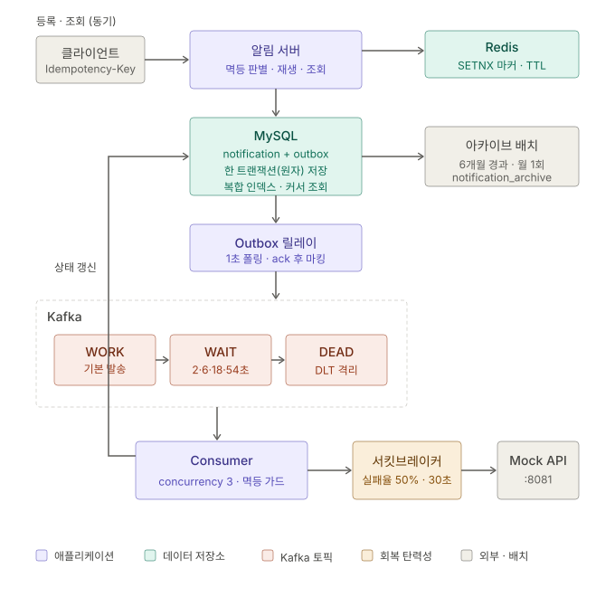
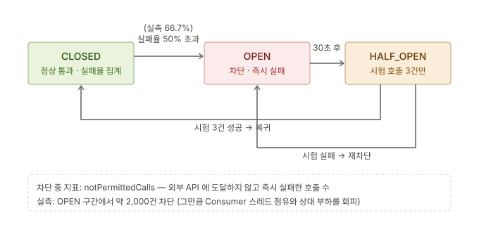

# 알림 발송 시스템

클라이언트의 알림 등록 요청을 받아 **Kafka 기반 비동기 파이프라인**으로 채널별(카카오톡/이메일/SMS) 발송하는 서비스.
발송은 **Mock Send API 실연동**(HTTP)이며, **멱등성(Redis + DB + 응답 재생)**, **Transactional Outbox(유실 방지)**,
**6단계 상태 머신(재처리/격리)**, **서킷브레이커(회복 탄력성)** 으로 중복·유실·장애를 다룬다.
구조는 **헥사고날 아키텍처**를 따르며, 조회는 **복합 인덱스 + 커서 페이징**, 누적 데이터는 **아카이빙 이관**으로 관리한다.

- Java 17 / Spring Boot 3.5 / Gradle
- MySQL (상태 영구 저장 + Outbox + 아카이브) · Redis(Redisson) (멱등성 1차 판별) · Kafka (비동기 발송 + 재시도/DLT)
- 발송 대상: Mock Send API (`POST /mock/send`, RestClient) · 회복 탄력성: Resilience4j
- ID 정책: **UUIDv7** (시간 정렬 UUID)

> 이전 버전 문서 — 설계 변천을 함께 보려면:
> [docs/README-v1.md](docs/README-v1.md) (AFTER_COMMIT 발행, 3-상태, Long PK) ·
> [docs/README-v2.md](docs/README-v2.md) (Outbox, 6-상태, UUIDv7, Mock API 연동, nGrinder 3회 측정)

---

## 1. 이번 작업(v3) 범위

v2에서 발송 파이프라인의 신뢰성을 확보한 뒤, 이번에는 **조회 기능 · 데이터 수명 관리 · 장애 시 회복 탄력성** 세 축을 다뤘다.

| 영역 | 구현 | 상세 |
|------|------|------|
| **요청자별 내역 조회** | 최근 7일 내역 API (발송 결과 포함) | [3.1](#31-요청자별-최근-7일-내역-조회) |
| **조회 성능** | 복합 인덱스 `(recipient, created_at)` — **풀스캔 11.1ms → 0.038ms**, 컬럼 순서까지 실측 비교 | [3.2](#32-조회-인덱스-설계--explain-기반-검증) |
| **페이징** | offset 구현 후 **커서(keyset) 페이징 추가** — 깊은 페이지 **370배** 개선 | [3.3](#33-페이징--offset-과-커서-실측-비교) |
| **누적 데이터 관리** | 6개월 경과분 **아카이브 이관**(삭제 아님) 배치 | [3.4](#34-누적-데이터-관리--아카이빙-이관) |
| **회복 탄력성** | **서킷브레이커** + 재시도 backoff 재설계 | [3.5](#35-서킷브레이커--지속-장애에서의-fail-fast) · [3.6](#36-재시도-backoff-재설계--서킷과의-상호작용) |
| **Outbox 릴레이 신뢰성** | 전면 정지 위험 제거(`continue`) · **`SKIP LOCKED`** 로 다중 인스턴스 중복 제거 · 조회 인덱스 | [3.7](#37-outbox-릴레이-신뢰성--전면-정지-위험과-다중-인스턴스-중복-제거) |
| **발송 이력 기록** | `attemptCount` · `lastErrorCode` · `lastAttemptAt` 로 **원인 추적을 로그에서 DB 로** | [3.8](#38-발송-이력-기록--몇-번-왜-실패했는가를-조회로-답한다) |

---

## 2. 아키텍처



v2 대비 추가된 요소는 **서킷브레이커**(Consumer → Mock API 경로), **아카이브 배치**(MySQL 수명 관리),
그리고 조회 경로의 **복합 인덱스·커서 페이징**이다. 등록·발행·발송의 골격(멱등 판별 → 원자 저장 → Outbox 릴레이 → Kafka → Consumer)은 v2와 같다.

상태 머신([docs/state-machine.svg](docs/state-machine.svg))과 패키지 구조(헥사고날)는 v2 문서를 참고.
이번 작업으로 추가된 클래스는 모두 기존 경계를 지켰다 — 조회는 포트에 메서드 추가, 아카이빙과 서킷브레이커는 **어댑터 내부에만** 존재하며 코어는 무변경.

---

## 3. 주요 설계 의사결정

### 3.1 요청자별 최근 7일 내역 조회

- **엔드포인트**: `GET /notifications/history?recipient=...&page=0&size=20` (offset),
  `GET /notifications/history-cursor?recipient=...&cursor=...&size=20` (커서)
- **파라미터 위치**: 수신자·기간·페이지는 "컬렉션의 검색 조건"이므로 **쿼리 파라미터**. 자원 식별자가 아니므로 path variable 이 아니다.
- **7일 정책**: `NotificationQueryService`(유스케이스). 컨트롤러나 어댑터가 아니라 **절차의 지식**이므로 코어에 둔다.
  size 상한(100)도 같은 이유로 유스케이스에 둬, 다른 어댑터(배치·관리자 API)가 호출해도 정책이 자동 적용된다.
- **응답에 발송 결과 포함**: `status`(6단계) + `sentAt` + `createdAt` + 내용. 성공/실패의 이분법이 아니라
  "재시도 대기 중(RETRY_WAIT)", "격리됨(DEAD)"까지 구분되어 보인다.

> **고민 흔적**
> - *path variable vs 쿼리 파라미터*: `/{recipient}` 형태는 기존 `/{id}`(단건 조회)와 URL 패턴이 충돌해
>   스프링이 핸들러를 구분할 수 없다. 의미상으로도 수신자는 자원이 아니라 필터 조건이다.
> - *"요청자"를 헤더로 받을지*: 커스텀 헤더에 신원을 받는 것은 쿼리 파라미터와 보안상 동급이다(클라이언트가 값을 임의로 정함).
>   신원은 검증된 인증 헤더에서 서버가 추출해야 의미가 있으므로, 인증 체계가 없는 현재는
>   "내부 시스템이 수신자를 지정해 조회하는 API"로 정직하게 정의했다.
> - *단건 Optional 반환의 위험*: 초기 구현에서 "내역"을 `Optional<Notification>` 으로 받았는데,
>   같은 수신자의 알림이 2건 이상이면 `NonUniqueResultException` 이 발생한다. 컴파일은 통과하지만 첫 호출부터 실패하는 구조였다.
> - *빈 결과의 상태 코드*: 단건 조회는 404가 맞지만 컬렉션 필터링에서 "조건에 맞는 것이 0개"는 정상 응답이므로 `200 []` 로 둔다.

### 3.2 조회 인덱스 설계 — EXPLAIN 기반 검증

- **결정**: `(recipient, created_at)` 복합 인덱스. **등호 조건 컬럼을 앞, 범위·정렬 컬럼을 뒤**에 두는 것이 원칙 —
  recipient 로 점프한 뒤 created_at 범위를 인덱스 순서대로 읽고, `ORDER BY ... DESC` 는 인덱스 역방향 읽기로 해결된다.

**측정 방법**

- **데이터**: 16,975행 / 수신자 102명, 전량 최근 7일 이내. 대상 수신자 매치 218건.
- **쿼리**: 실제 API 가 실행하는 형태 그대로 — `WHERE recipient = ? AND created_at > ? ORDER BY created_at DESC LIMIT 20`.
- **실행 계획·시간**: `EXPLAIN ANALYZE`. actual time 은 워밍업 후 8회 중앙값(버퍼풀 적재 상태).
- **읽은 양**: `FLUSH STATUS` → `SHOW STATUS` 의 `Handler_read_*` 카운터. EXPLAIN 의 `rows=` 는 옵티마이저 **추정치**이므로 판정 근거로 쓰지 않았다.
- **인덱스 구성 비교**: 후보 인덱스를 실제로 생성한 뒤 `FORCE INDEX` / `IGNORE INDEX` 로 고정. (측정 후 후보 인덱스는 삭제)

**실측 — 인덱스 구성 4종**

| 인덱스 구성 | 실행 계획 | 읽은 엔트리·행 | filesort | actual time |
|------|------|-----|-----|-----|
| 없음 | `Table scan` → `Filter` → `Sort` | 16,976 (`read_rnd_next`) | O | 11.1ms |
| `(recipient)` 단일 | `Index lookup(recipient)` → `Filter` → `Sort` | 219 (`read_key`+`read_next`) | **O** | 0.40ms |
| `(created_at, recipient)` — 순서 반대 | `Index range scan(created_at, reverse)` + ICP | 1,484 (`read_prev`) | X | 0.49ms |
| **`(recipient, created_at)` — 채택** | `Index range scan (reverse)` → `Limit` | **20** (`read_prev`) | X | **0.038ms** |

인덱스 없음 대비 **읽은 행 849배 감소, 응답 약 290배 개선**. 세 후보를 모두 남겨두고 옵티마이저에게 맡겼을 때도
채택안(`idx_recipient_created`)을 선택했다.

> **고민 흔적**
> - *"인덱스 넣었는데 효과가 없다"의 원인 — 측정 쿼리가 실제 API 쿼리와 달랐다*: 조건 하나만 걸고 `ORDER BY`·`LIMIT` 을 뺀
>   형태로 재면 옵티마이저가 아예 다른 계획을 고른다. 인덱스는 **쿼리 모양에 붙는 것**이라, 쿼리를 바꿔 측정하면 다른 인덱스를 측정한 셈이 된다.
> - *인덱스 사용 ≠ 개선*: 같은 테이블에서 `created_at` 단일 인덱스를 만들고 **매치율 100%**(16,975/16,975), `LIMIT` 없는 쿼리를 돌리면
>   인덱스 경유가 **오히려 1.5배 느리다**(14.5ms vs 풀스캔 9.8ms). 보조 인덱스는 "인덱스 엔트리 → PK → 실제 행" 왕복이 매 행마다 발생하므로,
>   어차피 전부 읽어야 하는 경우엔 순차 풀스캔이 싸다. 옵티마이저도 이 쿼리에서는 인덱스를 **버리고** `Table scan` 을 골랐다.
>   **판정 기준은 type/key 가 아니라 actual time 과 실제 읽은 행 수다.**
> - *컬럼 순서를 뒤집으면 왜 74배를 더 읽는가*: `(created_at, recipient)` 는 선두 컬럼이 범위 조건이라
>   recipient 로 구간을 좁힐 수 없다. 7일 범위 **전체**를 최신순으로 훑으며 인덱스 조건 푸시다운(ICP)으로 recipient 를 걸러내므로,
>   20건을 채우기까지 1,484 엔트리를 읽었다(채택안의 74배). 정렬은 공짜로 얻지만 스캔 폭이 수신자 수에 비례해 늘어난다.
>   **등호 조건이 앞, 정렬·범위가 뒤**라는 원칙은 취향이 아니라 이 스캔 폭 차이다.
> - *후행 컬럼 `created_at` 은 선택도가 아니라 정렬을 위해 붙였다*: `(recipient)` 단일 인덱스도 218건까지는 똑같이 좁힌다.
>   차이는 정렬로, 단일 인덱스에서는 `Sort_rows=20`·`Sort_scan=1` 로 **filesort 가 남고** 매치 218건을 전부 읽은 뒤에야 상위 20건을 고른다.
>   후행 컬럼을 붙이면 인덱스가 이미 `created_at` 순이라 역방향으로 20칸만 읽고 끝난다(`Handler_read_prev=19`, filesort 0).
>   즉 이 인덱스의 이득은 선택도가 아니라 **정렬 제거 + 조기 종료**에서 나온다.

### 3.3 페이징 — offset 과 커서 실측 비교

- **결정**: offset 방식을 먼저 구현해 요구사항을 충족하고, **커서(keyset) 방식을 별도 엔드포인트로 추가**해 두 방식을 실측 비교했다.
- **커서 = 알림 `id`(UUIDv7)**: 커서 페이징은 정렬 기준이 ① 고정 ② 유니크 ③ 불변이어야 성립한다.
  UUIDv7 은 시간 정렬 + 유니크 + PK(불변)라 **세 조건을 모두 만족**하므로, `created_at + id` 복합 커서 같은 우회 없이 `id` 하나로 끝난다.
- **hasNext 판별**: `size + 1` 건을 조회해 초과분 존재로 판단한다 — COUNT 쿼리 없이 다음 페이지 유무를 아는 방법.
- **응답**: `{ items, nextCursor, hasNext }`. 서버는 읽은 위치를 **기억하지 않고**(무상태),
  위치 상태는 커서에 담겨 클라이언트가 운반한다. 멱등키를 클라이언트가 들고 다니는 것과 같은 철학이다.

**실측 (동일 지점 = 26,000번째부터 20건)**

| | offset (`page=1300`) | cursor | 배수 |
|------|-----|-----|------|
| 실행 계획 | `Index scan (reverse)` 전체 훑기 → Filter → 26,000건 폐기 | `Index range scan over (id < 커서)` | |
| 실제 읽은 행 | 26,023 | **20** | 1,300배 적게 |
| actual time | 12.1ms | **0.033ms** | **약 370배** |
| 첫 페이지와 비교 | 0.24ms → 12.1ms (**50배 악화**) | 0.02ms → 0.033ms (**거의 동일**) | |

> **고민 흔적**
> - *커서 방식에서 Pageable 의 역할*: 페이지 이동이 아니라 LIMIT 전달 용도라 항상 `PageRequest.of(0, limit)` 이다.
>   page 를 0으로 못 박아 "커서로 위치를 정한 뒤 또 건너뛰는" 데이터 누락 사고를 구조적으로 막는다.
> - *깊은 offset 은 인덱스로도 못 고친다*: 26,000건을 건너뛰려면 그 행들을 실제로 만들어서 버려야 하므로,
>   옵티마이저는 인덱스 왕복보다 풀스캔+filesort 를 택한다(실측에서 인덱스를 버렸다). **offset 의 비용은 요구 자체에 내재한다.**
> - *그래서 커서로 전면 전환했는가*: 하지 않았다. 커서는 임의 페이지 점프와 전체 건수 표시가 불가능해
>   관리자 표 UI 에는 부적합하다. 두 엔드포인트를 유지해 용도별로 선택할 수 있게 두고, 비교 근거를 문서에 남겼다.

### 3.4 누적 데이터 관리 — 아카이빙 이관

- **결정**: 보존 기간(6개월)이 지난 **종결 상태** 알림을 `notification` → `notification_archive` 로 **이관**한다.
  삭제가 아니므로 데이터는 영구 보존되고, 조회가 집중되는 핫 테이블만 작게 유지된다.
- **아카이브 테이블 설계**: 인덱스는 PK 만(조회 빈도가 낮아 저장 공간·이관 비용 절약), 멱등성 유니크 제약 없음
  (멱등 판별은 핫 테이블의 책임이며 제약이 이관을 방해하지 않아야 한다), `archived_at` 으로 이관 시점 추적.
- **안전장치 4겹**:
  1. **종결 상태(SENT/FAILED/DEAD)만** 대상 — PENDING/PROCESSING/RETRY_WAIT 를 옮기면 발송이 유실된다.
  2. 복사와 삭제를 **한 트랜잭션**으로 묶어 반쪽 상태를 방지.
  3. 삭제는 `EXISTS (SELECT 1 FROM notification_archive ...)` 조건으로 **아카이브에 실존하는 행만** — 복사 누락분은 지워지지 않는다.
  4. 복사/삭제 건수 불일치 시 예외 → 롤백 후 수동 확인 유도.
- **청크 처리**: 1,000건 단위 반복. `INSERT ... SELECT` 네이티브 쿼리로 엔티티 로딩 없이 DB 내부에서 복사하므로 메모리 사용이 일정하다.

**실측**: 7·8·9개월 전 데이터 3건(SENT/FAILED/PENDING) 투입 → **SENT·FAILED 2건만 이관, PENDING 은 핫 테이블 잔류**.
총계 검증 26,807 + 2 = 26,809 (유실 0).

> **고민 흔적**
> - *월별 파티셔닝을 검토했으나 채택하지 않았다*: MySQL 은 파티션 테이블의 모든 유니크 인덱스에 파티션 키가 포함되기를 요구한다.
>   그러면 `UNIQUE(idempotency_key)` → `UNIQUE(idempotency_key, created_at)` 이 되어 **"같은 멱등키 + 다른 시각"이 허용**되고,
>   중복 방지의 최후 방어선(DB 백스톱)이 약화된다. 또한 PK 복합화(`id, created_at`)는 `@IdClass` 를 요구해
>   `findById(UUID)` 시그니처가 깨지고 포트·서비스까지 파급된다.
>   파티션 드롭의 이점(초 단위 이관)은 현재 데이터 규모에서 체감되지 않으므로, **멱등성 보증을 지키는 쪽**을 택했다.
> - *셀프 인보케이션 함정 재발*: 배치 클래스 안에 `@Transactional archiveChunk` 를 두고 같은 클래스에서 호출해
>   `InvalidDataAccessApiUsageException` 이 발생했다. 프록시를 거치지 않아 트랜잭션이 열리지 않은 것으로,
>   상태 머신 작업에서 `NotificationStatusRecorder` 를 분리했던 것과 **같은 원인**이다. `NotificationArchiveExecutor` 로 분리해 해결.
> - *outbox 는 이관이 아니라 삭제 대상*: 발행 완료된 큐 기록은 보존 가치가 없고(알림 원본은 notification 에 있다),
>   릴레이가 매초 `published = false` 를 스캔하므로 누적이 발송 파이프라인 성능에 직접 영향을 준다. (현재 미구현 — 7장 참고)

### 3.5 서킷브레이커 — 지속 장애에서의 fail-fast



- **문제**: 재시도만으로는 **지속 장애**에 대응할 수 없다. 외부 API 가 죽어 있으면 매 시도가 5초 타임아웃을 소진하며
  ① Consumer 스레드가 점유되고 ② 죽어가는 상대에게 부하를 더하고 ③ 재시도가 무의미하게 소모된다.
- **결정**: Resilience4j 서킷브레이커를 `MockNotificationApiClient`(**외부 호출의 유일한 접점**)에 적용.
  실패율이 임계를 넘으면 회선을 끊어 **호출 없이 즉시 실패**시키고, 대기 시간 후 시험 호출로 회복을 스스로 탐색한다.
- **fallback 은 "대체 응답"이 아니라 "예외 전파"**: 발송은 대체물을 만들 수 없는 행위다. 조용한 성공 처리는
  안 보냈는데 SENT 가 되는 유실이므로 금지. fallback 은 `NotificationSendException` 을 던져 **기존 재시도 파이프라인에 넘긴다.**
- **설정값과 근거** (모두 실측으로 검증)

| 설정 | 값 | 근거 |
|------|-----|------|
| sliding-window (COUNT_BASED) | 20건 | 발송 처리량 초당 ~5건 → 약 4초면 창이 차므로 감지가 충분히 빠르다 |
| minimum-number-of-calls | 10 | 표본이 적을 때(3건 중 2건 실패 등) 성급히 열리는 것을 방지 |
| failure-rate-threshold | 50% | **정상 모드(외부 실패율 10%)에서 관측된 실패율은 0~25% → 오탐 여지 확보.** 장애 모드(60%)에서는 12건 만에 개통 |
| wait-duration-in-open-state | 30s | 재시작·GC·일시 과부하가 지나갈 시간. 더 짧으면 회복을 방해, 더 길면 가용성 손실 |
| permitted-calls-in-half-open | 3 | 1건은 우연에 속을 수 있고, 많으면 아직 상대에 부담 |
| slow-call-duration / rate | 4s / 80% | RestClient 읽기 타임아웃(5s) 직전을 잡는다. **실패 0%인데도 열리는 두 번째 경로** — 죽지 않고 느려지는 장애가 더 위험하다 |

**실측 — 상태 전이와 차단 효과**

```
CLOSED (실패율 0~25%, 정상)              ← 외부 실패율 10% 구간에서는 열리지 않음(오탐 없음)
  ↓ 외부 실패율 60% 로 전환
CLOSED_TO_OPEN     실패율 66.7% (8/12) 에서 개통
OPEN_TO_HALF_OPEN  30초 후 자동 전이 (트래픽 없어도 스스로)
HALF_OPEN_TO_OPEN  시험 3건 중 2건 실패 → 1초 만에 재차단
  ... 30초 주기로 순환하며 회복 탐색
```

- 차단 지표 `notPermittedCalls`: 한 OPEN 구간에서 **약 2,000건**이 외부 API 에 도달하지 않고 즉시 실패했다.
  같은 건수를 타임아웃으로 처리했다면 Consumer 스레드가 그만큼 점유되고 장애 서버에 2,000건의 부하가 더해졌을 것이다.

> **고민 흔적**
> - *`bufferedCalls`*: 12~20이면 정상 트래픽 집계, **3이면 HALF_OPEN 시험 결과**다
>   (`permitted-calls-in-half-open=3` 과 일치). `notPermittedCalls` 가 감소해 보이면 그 사이 상태 전이로 통계가 리셋된 것이다.
> - *OPEN 에서는 실패율로 닫히지 않는다*: 실패율이 46%(임계 미만)여도 OPEN 이 유지된다. 닫히는 유일한 경로는
>   "대기 시간 경과 → HALF_OPEN → 시험 성공"이다. 이 비대칭(열릴 때는 실패율, 닫힐 때는 시험 통과)이
>   통계 진동에 따른 열림/닫힘 반복을 막는다.
> - *fallback 시그니처 규칙*: 원본과 같은 파라미터 + 마지막에 `Throwable`, 반환 타입 동일. 어긋나면 런타임에 fallback 을 찾지 못한다.
>   또한 클래스 레벨이 아니라 **메서드 레벨**에 붙여야 대상이 명확하다.

### 3.6 재시도 backoff 재설계 — 서킷과의 상호작용

- **발견한 문제**: 서킷브레이커를 적용한 뒤, 서킷 OPEN 구간(30초)과 재시도 총 대기 시간(2+4+8+16 = 약 30초)이
  **정면으로 겹쳐** 재시도 5회가 모두 "즉시 실패"로 소진되었다. 결과적으로 **복구 가능한 알림까지 FAILED 로 확정**됐다.
  (실측: 서킷 OPEN 중 등록된 알림이 전량 FAILED)
- **결정**: `multiplier` 를 2.0 → **3.0** 으로 조정. 2s → 6s → 18s → 54s, **총 약 80초**.
  서킷의 OPEN→HALF_OPEN 주기(30초)를 2~3회 통과할 수 있어, 상대가 회복되면 남은 재시도가 성공할 수 있다.
  `max-delay=60s` 상한을 두어 attempts 를 늘려도 지수 폭주가 없게 했다.

**실측 — 조정 후 (외부 실패율 50~60%, 부하 약 1.7만 건)**

| 경과 | PENDING | RETRY_WAIT | SENT | FAILED |
|------|-----|-----|-----|-----|
| t=0 | 14,674 | 2,282 | 11 | **0** |
| t=20s | 13,800 | 3,106 | 11 | 48 |
| t=40s | 13,311 | 3,354 | 12 | 290 |
| t=60s | 12,818 | 3,557 | 20 | 571 |
| t=80s | 12,282 | 3,786 | 20 | 877 |

- **FAILED 가 t=0 에 0이고 이후 나타난다** — 새 backoff(80초)를 소진한 알림이 그 시점부터 도착하기 때문이다.
  조정 전이라면 t=0 에 이미 FAILED 가 쌓여 있었다.
- **RETRY_WAIT 가 3,786건까지 부풀었다** — 아직 살 기회를 붙들고 있는 알림들이며, 조정 전에는 이미 FAILED 였을 물량이다.
- **SENT 가 11 → 20 으로 증가** — 서킷이 OPEN 인 중에도 HALF_OPEN 시험 구간에 걸린 재시도가 성공해 구제된 건들이다.
- **PENDING 이 초당 약 30건씩 소화** — 서킷 덕에 발송이 즉시 실패하므로 큐를 빠르게 비운다(타임아웃 방식이면 초당 ~0.6건).

> **고민 흔적**
> - *재시도와 서킷브레이커는 방향이 반대다*: 재시도는 "다시 시도" = 부하 증가, 서킷은 "시도 중단" = 부하 감소.
>   둘은 함께 써야 완성되지만 **시간 축이 겹치면 서로를 무력화한다.** 이번 문제는 그 상호작용을 실측으로 확인한 사례다.
> - *대가*: 최종 실패 판정이 30초 → 80초로 늦어진다. "복구 가능한 알림을 살리는" 이득과
>   "정말 죽은 알림의 FAILED 확정이 느려지는" 손실의 교환이며, 알림 도메인에서는 전자가 크다고 판단했다.
>   즉시 결과가 필요한 도메인(결제 승인 등)이라면 반대로 판단해야 한다.
> - *backoff 값이 토픽 이름에 박힌다*: `@RetryableTopic` 은 대기 시간으로 토픽을 만들기 때문에
>   multiplier 변경 시 `-retry-6000/18000/54000` 이 새로 생기고 옛 토픽(`-retry-4000/8000/16000`)은 미사용으로 남는다.
>   설정 변경이 인프라 리소스를 만든다는 점을 인지하고 정리 절차를 함께 둬야 한다.

### 3.7 Outbox 릴레이 신뢰성 — 전면 정지 위험과 다중 인스턴스 중복 제거

리뷰에서 지적된 두 결함을 해결했다. 둘 다 "정상 상황에서는 드러나지 않고, 장애·확장 시점에 터지는" 유형이다.

**문제 1 — 한 건의 실패가 발송 전체를 멈춘다**

기존 구현은 발행 실패 시 `return` 으로 메서드를 종료했다. 조회가 `ORDER BY id ASC` 이므로
영구 실패 메시지(잘못된 payload, 토픽 설정 오류 등)는 **매 주기 첫 번째로 뽑히고, 그 자리에서 종료**된다.
결과적으로 뒤의 메시지는 조회만 되고 한 번도 시도되지 않는다.

```
1초째: [1번(영구실패), 2번, ..., 100번] → 1번 실패 → return  → 발행 0건
2초째: [1번(영구실패), 2번, ..., 100번] → 1번 실패 → return  → 발행 0건
...    등록 API 는 계속 202 를 반환하지만 발송은 전면 정지 (조용한 장애)
```

- **결정**: `return` → `continue`. 실패한 건만 건너뛰고 나머지를 발행한다. 피해가 1건으로 국한된다.
- **근거**: 알림은 메시지 간 순서 보장이 필요 없다. 파티션 키가 알림 UUID(유니크)이고 파티션이 3개이므로
  애초에 소비 순서가 섞인다 — **지킬 필요 없는 순서를 지키려고 전면 정지 위험을 사고 있었다.**

**문제 2 — 릴레이 인스턴스를 늘리면 같은 메시지를 중복 발행한다**

일반 `SELECT` 는 읽기끼리 충돌하지 않으므로, 두 인스턴스가 같은 100건을 함께 읽어 각자 발행한다.

- **결정**: `FOR UPDATE SKIP LOCKED` 로 조회한다. 읽은 행에 배타 락을 걸고, 이미 잠긴 행은 건너뛴다.
  A가 1~100번을 잠그면 B는 그것을 스킵하고 101~200번을 가져가므로 **중복 없이 처리량이 인스턴스 수만큼 늘어난다.**
- **트랜잭션 경계**: 잠금은 트랜잭션 안에서만 유효하다. 조회·발행·마킹을 하나의 트랜잭션으로 묶되,
  `OutboxRelay`(스케줄)와 `OutboxPublishExecutor`(트랜잭션)를 **별도 빈으로 분리**했다 —
  같은 클래스 내부 호출은 프록시를 우회해 트랜잭션이 열리지 않고, 그러면 잠금 자체가 성립하지 않는다.

**문제 3 — 조회 쿼리의 테이블 성장 대응**

`published = false` 조건에 인덱스가 없으면 릴레이가 **매초 풀스캔**한다. outbox 는 발행 완료 행이 계속 누적되므로
시간이 지날수록 이 비용이 선형 증가한다.

- **결정**: `(published, id)` 복합 인덱스. 등호 조건(published) → 정렬(id) 순서로 두어
  미발행분만 짚고 LIMIT 에서 조기 종료된다. 미발행분은 통상 소수이므로 선택도가 좋다.
- 인덱스만으로는 부족하다 — 발행 완료 행 누적 자체를 줄이는 정리 배치가 함께 필요하다.

**설정 외부화**: `batch-size`(100), `poll-interval`(1000ms), `ack-timeout-ms`(5000)를 프로퍼티로 분리해
부하 상황에 맞춰 조정할 수 있게 했다.

**검증**: 알림 3건 등록 → outbox `published=1` 전량 확인, `idx_outbox_published_id` 생성 확인, 릴레이 에러 0건.

> **고민 흔적**
> - *"순서 보장"이 실은 비용이었다*: 저장 순서대로 발행하려는 의도는 자연스러웠지만, 그 대가가 "전면 정지 위험"이었다.
>   순서 보장이 필요한 도메인(계좌 입금→출금 등)이라면 `return` 이 옳고, 대신 실패 격리 정책이 필수다.
>   **요구사항에 없는 보장을 지키려다 더 큰 위험을 사는 것**을 경계하게 된 사례다.
> - *SKIP LOCKED 는 잠금이면서 분배 장치다*: 일반적인 락은 "기다리게" 만들지만, SKIP LOCKED 는 "다른 일감을 집게" 만든다.
>   중복 방지와 병렬 처리를 동시에 얻는 구조라, 큐를 DB 로 구현할 때의 표준 패턴이다.
>   ShedLock(단일 실행 보장)도 후보였으나 그쪽은 인스턴스를 늘려도 처리량이 늘지 않아 채택하지 않았다.
> - *네이티브 쿼리를 쓴 이유*: JPA 파생 쿼리로는 `SKIP LOCKED` 를 표현할 수 없고, `@Lock(PESSIMISTIC_WRITE)` 은
>   `FOR UPDATE` 까지만 지원한다(대기 발생). 어댑터 내부이므로 네이티브 SQL 사용이 경계를 침범하지 않는다.

### 3.8 발송 이력 기록

기존에는 알림에 **상태만** 있어 운영 질문에 답할 수 없었다. 실패 원인은 DLT 로그에만 남아 로그가 사라지면 추적이 불가능했다.

| 운영 질문 | 이전 | 이후 |
|------|------|------|
| 몇 번 시도했는가 | 알 수 없음 | `attemptCount` |
| 마지막 실패 원인이 타임아웃인가 5xx인가 | DLT 로그를 뒤져야 함 | `lastErrorCode` (HTTP_500 · TIMEOUT · CIRCUIT_OPEN 등) |
| 언제 다시 시도되는가 | 알 수 없음 | `lastAttemptAt` + `attemptCount` + backoff 정책으로 추정 |

- **필드**: `attemptCount`, `lastAttemptAt`, `lastErrorCode`(50자), `lastErrorMessage`(500자, 초과 시 도메인에서 절단).
  상태 조회·내역 조회 응답에 함께 노출한다.
- **시도 횟수는 `markProcessing()` 에서 증가한다** — 성공·실패가 아니라 **시도 시작** 시점이다.
  그래야 ① SENT 도 "몇 번째 시도에 성공했는지"를 남기고 ② 크래시로 결과 기록이 누락된 시도도 집계된다.
- **원인 분류의 위치**: HTTP 상태·타임아웃·서킷 차단 판정은 프로토콜 지식이므로 어댑터(`SendErrorClassifier`)에서 수행하고,
  결과 코드만 `NotificationSendException` 에 실어 코어로 전달한다. **코어는 코드 문자열만 다루므로 특정 클라이언트 구현에 묶이지 않는다.**
- **아카이브도 함께 이관**: `notification_archive` 에 동일 컬럼을 추가하고 `INSERT ... SELECT` 목록에 포함했다 —
  이관 후에도 사후 원인 분석이 가능해야 한다.

**실측** — sendmock 60% 실패 + 서킷 OPEN 상태에서 알림 5건 등록 후 조회:

```json
{
  "status": "RETRY_WAIT",
  "attemptCount": 3,
  "lastAttemptAt": "2026-08-05T01:16:16.010",
  "lastErrorCode": "CIRCUIT_OPEN",
  "lastErrorMessage": "Mock Send API 호출 실패 id=019fcd8f-... (CircuitBreaker 'mockSendApi' is OPEN and does not permit further calls)"
}
```

3회 시도했고, 마지막 실패가 **서킷 차단**이며(외부 API 5xx 가 아니라), 언제 시도했는지가 전부 DB 에 남는다.

> **고민 흔적**
> - *시도 횟수를 어디서 증가시킬까*: 실패 시점에 증가시키면 "성공한 알림의 시도 횟수"가 항상 0이 되고,
>   크래시로 결과를 기록하지 못한 시도가 집계에서 빠진다. **시도 시작(PROCESSING 전이) 시점**이
>   "attempt = 시도"라는 정의와 일치하며 두 문제를 함께 해결한다.
> - *에러 코드를 누가 만드나*: 코어가 `HttpStatusCodeException` 을 해석하면 코어가 HTTP 를 알게 된다.
>   어댑터에서 분류하고 코어는 문자열만 저장하는 구조라, 발송을 gRPC 나 SDK 로 바꿔도 코어는 무변경이다.
>   서킷 차단(`CallNotPermittedException`)까지 분류 대상에 넣어 "장애가 지속되어 호출조차 못 했다"를 구분할 수 있게 했다.
> - *DLT 시점의 코드는 종결 사유로 남긴다*: DLT 핸들러는 개별 시도의 원인을 알 수 없고 헤더 정보만 갖는다.
>   따라서 `RETRY_EXHAUSTED`(재시도 소진) / `UNRECOVERABLE`(복구 불가)이라는 **종결 사유**를 기록하고,
>   구체적 실패 원인은 직전 재시도가 남긴 기록(RETRY_WAIT 시점의 코드)에서 확인한다.
> - *에러 메시지 길이 제한을 도메인에 둔 이유*: 스택트레이스가 섞이면 수천 자가 되어 컬럼 길이를 넘긴다.
>   절단을 어댑터가 아니라 도메인(`MAX_ERROR_MESSAGE_LENGTH`)에서 하면, 어떤 저장소를 쓰더라도 불변식이 유지된다.
> - *`nextRetryAt` 을 저장하지 않은 이유*: 재시도 스케줄의 주인은 Kafka 재시도 토픽이다.
>   앱이 별도로 예상 시각을 저장하면 실제 스케줄과 어긋날 수 있어(중복 진실), `lastAttemptAt` + `attemptCount` +
>   공개된 backoff 정책으로 **추정 가능한 형태**만 남겼다.

---

## 4. API 명세 (v3 추가분)

### 요청자별 최근 7일 내역 — offset 페이징

```
GET /notifications/history?recipient=010-1234-5678&page=0&size=20
→ 200 [ { "id":"019f...", "channel":"KAKAO", "recipient":"...", "title":"...", "message":"...",
          "status":"SENT", "createdAt":"...", "sentAt":"...",
          "attemptCount":2, "lastAttemptAt":"...", "lastErrorCode":"HTTP_503", "lastErrorMessage":"..." }, ... ]
```

### 요청자별 최근 7일 내역 — 커서 페이징

```
GET /notifications/history-cursor?recipient=010-1234-5678&size=20          (첫 요청: cursor 생략)
GET /notifications/history-cursor?recipient=010-1234-5678&size=20&cursor=019f...   (이후)
→ 200 { "items": [ ... ], "nextCursor": "019f...", "hasNext": true }
```

- 응답의 `nextCursor` 를 다음 요청의 `cursor` 로 그대로 전달한다. `hasNext: false` 면 마지막 페이지.
- 검증 실패(size 범위 초과 등)는 `400`, 빈 결과는 `200` + 빈 배열.

v2 의 등록(`POST /notifications`)·단건 조회(`GET /notifications/{id}`)와 멱등 응답 규칙은 변경 없음 — [docs/README-v2.md](docs/README-v2.md) 참고.

---

## 5. 실행 방법

> 필요 인프라: **MySQL · Redis · Kafka**(docker compose) + **Mock Send API**(sendmock, :8081)

```bash
docker compose up -d                                    # MySQL(3306) · Redis(6379) · Kafka(9092)
# sendmock 을 8081 에서 실행
./gradlew bootRun --args='--spring.profiles.active=local'   # 알림 앱 (8080)
```

### 서킷브레이커 관측

```bash
# 현재 상태 (state, failureRate, slowCallRate, notPermittedCalls)
curl -s http://localhost:8080/actuator/circuitbreakers

# 상태 전이 이력 (STATE_TRANSITION)
curl -s "http://localhost:8080/actuator/circuitbreakerevents?name=mockSendApi"
```

### 상태 분포 확인

```bash
docker exec seunggu-mysql mysql -uroot -proot1234 seunggu \
  -e "SELECT status, COUNT(*) FROM notification GROUP BY status;"
```

### 장애 상황 재현 (서킷 개통 관측용)

sendmock 의 `mock.failure.probability` 를 `0.60` 으로 올리고 **재시작**한 뒤 부하를 준다.
설정 파일만 바꾸고 재시작하지 않으면 반영되지 않으므로, 프로브로 실제 실패율을 먼저 확인한다.

---

## 6. 성능 측정 요약

v2 의 nGrinder 측정(등록 TPS·Consumer 동시성)은 [docs/README-v2.md](docs/README-v2.md) 5장 참고.
이번 작업의 측정은 **쿼리 레벨**과 **장애 상황의 파이프라인 거동**에 집중했다.

| 측정 | 결과 |
|------|------|
| 복합 인덱스 적용 (3.2) | 16,976행 스캔 11.1ms → **20행 0.038ms (약 290배)** |
| 복합 인덱스 컬럼 순서 (3.2) | `(created_at, recipient)` 1,484엔트리 0.49ms → **`(recipient, created_at)` 20엔트리 0.038ms** |
| offset vs 커서, 깊은 페이지 (3.3) | 26,023행 12.1ms → **20행 0.033ms (약 370배)** |
| 커서의 깊이 독립성 (3.3) | 첫 페이지 0.02ms ≈ 26,000번째 지점 0.033ms |
| 서킷 차단 효과 (3.5) | OPEN 구간에서 **약 2,000건** 외부 호출 회피 |
| backoff 조정 (3.6) | FAILED 확정 30초 → 80초 지연, RETRY_WAIT 3,786건 생존, SENT 구제 관측 |
| 발송 이력 (3.8) | 서킷 OPEN 상태에서 `attemptCount=3`, `lastErrorCode=CIRCUIT_OPEN` 이 조회 API 로 확인 — 로그 없이 원인 추적 |
| Outbox 릴레이 (3.7) | 실패 1건이 배치 전체를 막지 않음 · `(published, id)` 인덱스로 매초 풀스캔 제거 · `SKIP LOCKED` 로 인스턴스 간 구간 분리 |


