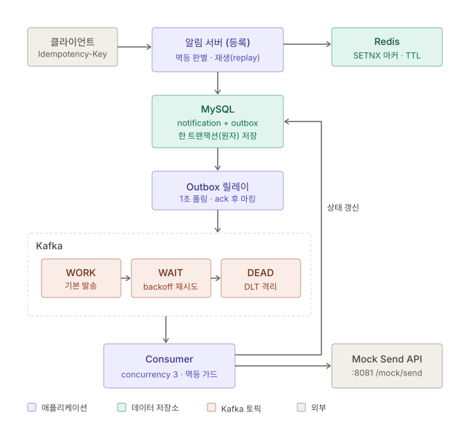
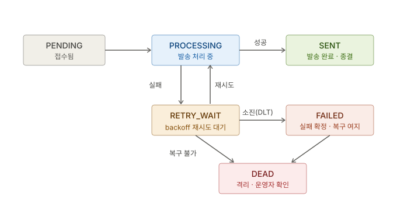
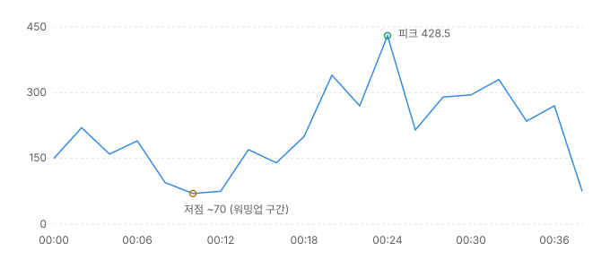
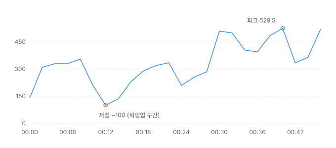
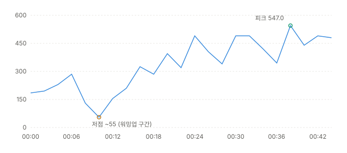

# 알림 발송 시스템

클라이언트의 알림 등록 요청을 받아 **Kafka 기반 비동기 파이프라인**으로 채널별(카카오톡/이메일/SMS) 발송하는 서비스.
발송은 **Mock Send API 실연동**(HTTP)이며, **멱등성(Redis + DB + 응답 재생)**, **Transactional Outbox(유실 방지)**,
**6단계 상태 머신(재처리/격리)** 으로 중복·유실·장애를 다룬다. 구조는 **헥사고날 아키텍처**를 따른다.

- Java 17 / Spring Boot 3.5 / Gradle
- MySQL (상태 영구 저장 + Outbox) · Redis(Redisson) (멱등성 1차 판별) · Kafka (비동기 발송 + 재시도/DLT)
- 발송 대상: Mock Send API (`POST /mock/send`, RestClient 연동)
- ID 정책: **UUIDv7** (시간 정렬 UUID)

> 📜 초기 버전 문서: [docs/README-v1.md](README-v1.md) — AFTER_COMMIT 발행, 3-상태, Long PK 시절의 설계와 고민이 담겨 있다.

---

## 1. 요구사항 분석

### 기능 요구사항 (과제 포인트)

| 과제 포인트 | 구현 | 상세 |
|------|------|------|
| **Mock Send API 실제 연동** | ✅ | `RestClient` 로 `POST /mock/send` 호출. 요청 규격(requestId/channelType/receiver/message) 준수, 타임아웃(연결 2s/응답 5s) 설정 → [3.4](#34-mock-send-api-연동--restclient) |
| **실패 시 재처리 흐름 설계** | ✅ | 실패 즉시 `RETRY_WAIT` 기록(독립 트랜잭션) + `@RetryableTopic` backoff(2s→4s→8s→16s) 재시도 → [4장](#4-실패-처리-흐름) |
| **최대 재시도 초과 시 DEAD 분리** | ✅ | DLT 도착 시 원인 예외로 분기 — 발송 실패는 `FAILED`(복구 여지), 예상 밖 오류는 `DEAD`(격리) → [4장](#4-실패-처리-흐름) |
| **성능 측정과 문서화** | ✅ | nGrinder 부하 테스트 2회 — 병목 발견(Consumer 동시성) → 개선(2.5배) → 2차 병목 식별의 측정 사이클 → [5장](#5-성능-측정-ngrinder) |

- 알림 등록 API — `POST /notifications` (202 Accepted, 비동기 발송)
- 알림 상태 조회 — `GET /notifications/{id}`
- 상태(PENDING/PROCESSING/SENT/RETRY_WAIT/FAILED/DEAD)를 DB에 저장

### 비기능 요구사항 (발굴)

| 문제 | 해결 전략 |
|------|-----------|
| **중복 등록/발송** | 클라이언트 멱등키 + Redis `SETNX` 1차 판별 + DB 유니크 백스톱 + **재요청 응답 재생(replay)** + Consumer 상태 가드 + requestId 로 외부 API 까지 멱등 전달 |
| **메시지 유실** | **Transactional Outbox** — 알림 저장과 발행 예약을 한 트랜잭션으로 원자화, 릴레이가 브로커 ack 확인 후 마킹 |
| **장애 내구성** | 재시도(RETRY_WAIT + backoff) + 데드레터(FAILED/DEAD 분리 격리) — 모든 실패가 "유실"이 아닌 "지연 또는 격리"로 수렴 |
| **관측 가능성** | 6단계 상태 머신 — "지금 처리 중"(PROCESSING), "재시도 대기"(RETRY_WAIT)가 외부에서 조회 가능 |
| **채널 확장성** | 전략 패턴(`NotificationSender` + Resolver) — 채널 추가 시 `@Component` 하나 |
| **코어-기술 분리** | 헥사고날(포트·어댑터) — 발행 전략 교체(AFTER_COMMIT→Outbox), 발송 교체(로그→HTTP)에서 코어 무변경 실증 |

---

## 2. 아키텍처



**상태 머신** — 각 상태가 언제, 누구에 의해 변경되는지가 설계의 핵심이다:



| 전이 | 시점 | 트랜잭션 |
|------|------|----------|
| → `PENDING` | 등록 커밋 (outbox 기록과 원자) | 등록 tx |
| → `PROCESSING` | Consumer 가 집은 직후, **발송 전에 커밋** | 독립 tx1 |
| → `SENT` | Mock API 응답 확인 후 | 독립 tx2 |
| → `RETRY_WAIT` | 발송 실패 직후 (본 트랜잭션 롤백과 분리) | 독립 tx |
| → `FAILED` | 재시도 소진(DLT), 원인이 발송 실패일 때 | 독립 tx |
| → `DEAD` | DLT 도착, 원인이 예상 밖 오류(복구 불가)일 때 | 독립 tx |

### 패키지 구조 (헥사고날)

```
com.example.seunggu.notification
├─ domain/                          ◀ 코어 — 순수 자바, 프레임워크 무지
│   ├─ Notification                   (상태 전이 규칙을 도메인이 강제 — 허용 외 전이는 예외)
│   ├─ NotificationStatus             (6단계 상태 + 전이 다이어그램 문서화)
│   └─ NotificationChannel
├─ application/                     ◀ 코어 — 유스케이스 계층
│   ├─ port/in/                       RegisterNotificationUseCase · SendNotificationUseCase
│   │                                 · FindNotificationQuery · Command/Result
│   ├─ port/out/                      NotificationPersistencePort · IdempotencyPort
│   │                                 · RegisteredEventPort · SendPort
│   └─ service/                       RegisterNotificationService (멱등 판별·재생)
│                                     · NotificationRegistrar (등록 트랜잭션 경계)
│                                     · SendNotificationService · NotificationStatusRecorder
│                                     (상태 전이용 독립 트랜잭션 — 별도 빈으로 프록시 우회 방지)
└─ adapter/
    ├─ in/web/                        NotificationController + dto
    ├─ in/kafka/                      NotificationConsumer (@RetryableTopic · DLT 분기)
    └─ out/
        ├─ persistence/               JpaEntity(UUIDv7 생성) · Repository · Adapter
        ├─ redis/                     RedissonIdempotencyAdapter (SETNX + TTL)
        ├─ outbox/                    OutboxEventAdapter · OutboxRelay (폴링 발행)
        └─ sender/                    채널별 Sender(전략) · MockNotificationApiClient
```

---

## 3. 주요 설계 의사결정

### 3.1 멱등성 = 클라이언트 키 + Redis 선점 + DB 백스톱 + **응답 재생(replay)**

- **판별 주체 = Redis**: `SETNX + TTL`(24h) 로 원자적 선점 — 판별과 동시성 차단을 한 번에.
- **최후 방어선 = DB**: `idempotency_key` 유니크 제약. Redis 유실/TTL 만료에도 중복 INSERT 불가.
- **재요청 = 거절이 아니라 재생**: 같은 키의 재요청에는 `findByIdempotencyKey` 로 기존 결과를 찾아
  **첫 요청과 동일한 202 응답(id 포함)** 을 돌려준다. 409 는 "아직 처리 중(커밋 전)"일 때만.
- **판정 원칙 — 예외로 추측하지 않고 DB 에 묻는다**: 저장 실패 시 예외 타입이 아니라
  "이 키로 실제 저장된 행이 있는가"로 분기한다. 행이 있으면 진짜 중복(재생), 없으면 처리된 적 없음(마커 회수 + 원래 예외 전파).

> **고민 흔적**
> - *409 → 재생 전환*: 초기 구현은 중복이면 무조건 409 였다. 그러나 멱등키의 핵심 시나리오는 "응답을 못 받은
>   클라이언트의 재시도"인데, 409 만 주면 클라이언트는 등록 여부도 id 도 알 수 없어 막다른 골목에 갇힌다(TTL 24h 동안).
>   멱등 API 는 부작용만이 아니라 **응답까지 멱등**해야 완성 — 재생 방식으로 전환했다.
> - *DataIntegrityViolationException ≠ 중복*: 저장 실패를 전부 "중복"으로 번역하던 초기 코드는 title 길이 초과 같은
>   다른 무결성 위반까지 409 로 오분류했고, 그 분기가 마커를 회수하지 않아 **잘못된 요청 하나가 멱등키를 24시간 잠갔다.**
>   두 문제의 뿌리가 같았다 — "실제 처리 여부를 확인하지 않고 추측으로 응답" — 그래서 어댑터의 예외 번역을 제거하고
>   DB 조회 기반 판정으로 통일했다. 길이 검증(400)도 마커 선점 전 단계에 추가.

### 3.2 Transactional Outbox 패턴 적용 — "커밋과 발행 사이"의 유실 창 제거

- **문제**: DB 커밋과 Kafka 발행은 서로 다른 시스템이라 하나의 트랜잭션으로 묶을 수 없다(이중 쓰기 문제).
  "커밋 성공 → 발행 직전 크래시"가 나면 알림은 DB 에 영원히 PENDING 인데 발송을 트리거할 메시지는
  세상에 존재하지 않는다 — **조용한 유실**.
- **결정**: 발행이라는 롤백 불가능한 연산을 "같은 DB 에 기록하기"라는 **트랜잭션 가능한 연산으로 치환**한다.
  "발행할 메시지"를 `outbox_message` 테이블에 알림과 같은 트랜잭션으로 INSERT 하고,
  실제 발행은 재시도 가능한 릴레이에게 맡긴다.

**적용 방식** — 두 개의 어댑터로 구현:

```
[쓰기] 등록 트랜잭션 (NotificationRegistrar.persist)
BEGIN
  INSERT INTO notification   (...)   -- 알림 원본 (PENDING)
  INSERT INTO outbox_message (...)   -- 발행 예약: topic · key = 알림 UUID · published = false
COMMIT                               -- 둘이 한 운명: 함께 확정되거나 함께 없던 일

[발행] OutboxRelay (@Scheduled 1초 폴링)
미발행분 조회 (published = false, ORDER BY id — 저장 순서 보장)
  → Kafka 발행 → 브로커 ack 를 동기로 확인 → 확인된 것만 published = true 마킹
  → 발행 실패 시 마킹 없이 중단, 다음 주기에 같은 순서로 재시도 (Kafka 가 죽어 있어도 쌓이기만 할 뿐 유실 없음)
```

- `OutboxEventAdapter` — `RegisteredEventPort` 의 구현. Kafka 직접 발행 대신 outbox INSERT (호출부 트랜잭션에 참여).
- `OutboxRelay` — 유일한 Kafka Producer. "ack 확인 → 마킹" 순서라 유실 방향의 실패가 불가능하고,
  "발행 후 마킹 전 크래시"는 재발행(중복)으로만 나타난다.
- payload 는 알림 UUID 뿐 (claim check) — 내용 전체를 싣지 않아 stale 데이터가 없고 DB 가 단일 진실.
- **효과**: 크래시 지점이 어디든 outbox 행이 디스크에 남아 재기동 후 발행된다(→ 4장 크래시 지점 표).
  남는 것은 중복 발행(at-least-once)뿐이며 Consumer 멱등 가드가 흡수한다.

> **고민 흔적**
> - 이전의 문제점은 "커밋 전 발행"은 막아주지만 "커밋 후 발행이 안 되는" 유실은 못 막는다 —
>   이를 Outbox 로 해소했다. 비용은 폴링 지연(최대 1초)과 outbox 테이블 관리.
> - *outbox 의 payload = 알림 id 만* (claim check): 내용 전체를 싣지 않아 stale 데이터 문제가 없고, DB 가 단일 진실.

### 3.3 6단계 상태 머신 — 전이 규칙을 도메인이 강제

- **결정**: 상태를 3개(PENDING/SENT/FAILED)에서 6개로 확장하고, 전이는 도메인의 `mark*()` 메서드로만 가능하며
  허용 목록 밖의 전이는 `IllegalStateException` 으로 거부한다 (예: SENT/DEAD 는 종결 — 빠져나갈 수 없음).
- **발송 트랜잭션 3분할**: `PROCESSING 선커밋(tx1) → 발송(트랜잭션 밖) → SENT 확정(tx2)`.
  중간 상태가 커밋돼야 외부에서 관측 가능하고, 느린 외부 호출이 DB 커넥션을 점유하지 않는다.

> **고민 흔적**
> - *통 트랜잭션의 한계*: 기존 `send()` 는 커밋이 1회뿐이라 PROCESSING 을 어디에 넣어도 기록될 수 없었고
>   (커밋 시점엔 이미 SENT), 실패 시 롤백이 실패 기록까지 지웠다. 상태 가시성이라는 요구가 커밋 분할을 강제했다.
> - *RETRY_WAIT 기록과 롤백의 충돌*: 실패 기록을 본 트랜잭션에서 하면 롤백에 같이 지워진다 → 상태 기록 전용
>   `NotificationStatusRecorder` 를 **별도 빈**으로 분리 (같은 클래스 내 호출은 프록시를 우회해 @Transactional 이 무시되는
>   셀프 인보케이션 함정 회피).
> - *재전달 재진입*: PROCESSING 커밋 직후 크래시 → offset 미커밋 → 같은 메시지 재전달 시 PROCESSING → PROCESSING
>   재진입을 허용하지 않으면 억울한 DLT 행이 된다. 전이 허용 목록에 반영.
> - *발송-커밋 사이의 창*: 발송 성공 후 SENT 커밋 전에 죽으면 중복 발송 가능(WYSIWYG 하게 PROCESSING 잔존으로 관측됨).
>   순서를 뒤집으면(커밋 후 발송) 실패가 **조용한 유실**이 되므로, 알림 도메인에선 "시끄러운 중복"을 선택하고
>   외부 API 멱등키(requestId)로 닫는 것을 개선 방향으로 문서화.

### 3.4 Mock Send API 연동 — RestClient

- **결정**: 발송을 콘솔 로그에서 **실제 HTTP 호출**(`POST /mock/send`)로 교체. 클라이언트는 `RestClient`.
- **요청 매핑**: `requestId = 알림 UUID` / `channelType` / `receiver` / `message` — 외부 API 규격의 DTO 는
  어댑터 내부(`adapter/out/sender/dto`)에 가둔다.
- **requestId = 알림 UUID 인 이유**: 재시도가 같은 requestId 로 나가므로, 외부 API 가 dedup 을 지원하면
  "발송 성공 후 커밋 실패 → 재발송" 창의 중복까지 수신 측에서 차단된다 — HTTP 멱등키에서 시작한
  멱등성 이어달리기가 발송 구간까지 완주.
- **타임아웃 필수**: 연결 2s / 응답 5s — 발송은 Kafka 리스너 스레드에서 실행되므로 무응답 API 가 스레드를 점유하지 않도록 한다.
- **실패 = 예외 그대로 전파**: 4xx/5xx 는 `RestClientException` → 재시도 파이프라인의 트리거. 삼키지 않는다.

> **고민 흔적**: *RestClient vs WebClient* — 서블릿(블로킹) 스택 + "응답을 확인해야 상태를 확정"하는 순차 흐름이라
> 동기 클라이언트가 정합. 처리량은 HTTP 클라이언트가 아니라 Kafka 파티션 병렬성이 담당한다.
> WebClient 는 리액티브 스택 또는 다중 API 병렬 조합이 필요할 때의 도구.

### 3.5 헥사고날 아키텍처 — 포트는 코어가 소유

- **규칙 하나**: 의존성은 항상 안쪽으로 — 코어(`domain`, `application`)는 기술을 import 하지 않는다.
- **포트의 비대칭**: 인바운드 포트(UseCase)는 코어의 능력이라 **코어(서비스)가 구현**하고 어댑터(Controller/Consumer)가 호출,
  아웃바운드 포트는 바깥의 능력이라 **어댑터가 구현**하고 코어가 호출. "그 기능을 실제로 가진 쪽이 구현한다."
- **실증된 이득**: 발행 전략 교체(3.2), 발송 방식 교체(3.4) 모두 어댑터 폴더 교체로 끝났고 코어 무변경.


### 3.6 ID 정책 = UUIDv7

- **결정**: PK 를 auto-increment Long 에서 **UUIDv7**(시간 정렬 UUID, RFC 9562)로 전환. MySQL `BINARY(16)`.
- **이유**: 앱에서 생성 가능(DB 왕복 불요, IDENTITY 의 배치 제약 해소), 분산 환경 충돌 없음, 순번 추측 공격 불가,
  그리고 v4 와 달리 **시간 정렬이라 B-tree 인덱스 친화적**. 앞 48비트가 타임스탬프라 ID 만으로 생성 시각 추적 가능.

> **고민 흔적**: Hibernate 6.6 에는 v7 내장 생성기가 없다(7.0 예정) — `@UuidGenerator` 의 `algorithm` 확장점에
> uuid-creator 라이브러리를 연결한 커스텀 `Uuid7Generator` 로 해결. Kafka 파티션 키도 UUID 문자열이 되지만
> "유니크 값 → 고른 분산" 성질은 동일. outbox PK 는 의도적으로 auto-increment 유지 — 외부 노출이 없는 내부 큐라
> UUID 의 이점이 없고, 릴레이의 `ORDER BY id` 발행 순서 보장엔 단순한 정수가 낫다.

### 3.7 파티션 키 = `notificationId` · Consumer `concurrency = 3`

- **파티션 키**: 알림 간 순서 요구가 없으므로 유니크 값으로 전 파티션에 고른 분산(처리량 극대화).
  수신자별 순서가 필요해지면 key 만 `recipient` 로 교체 가능하도록 열어둠.
- **concurrency = 3**: 파티션 수와 일치 — 기본값(1)은 스레드 하나가 파티션 3개를 순회해 병렬성이 사장된다.
  부하 테스트에서 이 병목을 실측으로 확인하고 조정했다 (→ 5장).

---

## 4. 실패 처리 흐름

**재처리 설계와 DEAD 분리의 상세.**

### 재처리 파이프라인

```
발송 실패 (Mock API 5xx/타임아웃)
  → Consumer 가 catch: markRetryWait (독립 트랜잭션 — 롤백과 무관하게 RETRY_WAIT 기록)
  → NotificationSendException 으로 감싸 재전파 (예외를 삼키면 재시도가 죽는다)
  → @RetryableTopic: WAIT 토픽에서 backoff 재시도 (2s → 4s → 8s → 16s, 총 5회 시도)
  → 재시도 성공 시: RETRY_WAIT → PROCESSING → SENT (자동 복구)
  → 5회 소진 시: DLT 도착
```

### DLT 에서의 FAILED / DEAD 분기

DLT 메시지의 **원인 예외 헤더**(`kafka_exception-cause-fqcn`)로 판정한다:

| 원인 | 판정 | 의미 |
|------|------|------|
| `NotificationSendException` (우리가 인지하고 감싼 발송 실패) | **FAILED** | 외부 API 장애 등 — 시간이 지나면 운영자 재발송 여지 |
| 그 외 (파싱 불가, 상태 전이 위반 등 예상 밖 오류) | **DEAD** | 재발송해도 같은 실패 — 자동 처리 중단, 운영자 확인 필요 |
| 메시지 id 자체가 파싱 불가 | 마킹 불가 — 로그 후 종료 | DB 에 기록할 대상이 없음 (수동 확인) |

> **고민 흔적**
> - *중간 실패는 상태를 확정하지 않는다*: FAILED 확정은 DLT 에서만 — 3차 실패 후 4차에 성공할 수 있기 때문.

### 크래시 지점별 결과 — 유실이 구조적으로 없는 이유

| 크래시 지점 | 남는 것 | 결과 |
|-------------|---------|------|
| 등록 트랜잭션 중 | 없음 (롤백, 마커 회수) | 클라이언트 재시도로 처음부터 — 깨끗한 실패 |
| 등록 커밋 후 ~ 릴레이 발행 전 | **outbox 미발행 행** | 재기동 후 릴레이가 발행 — 늦지만 유실 없음 |
| 릴레이 발행 후 ~ 마킹 전 | outbox 미발행으로 보임 | 재발행(중복) → Consumer 가드가 스킵 |
| PROCESSING 커밋 후 크래시 | PROCESSING 잔존 | offset 미커밋 → 재전달 → 재진입 허용으로 재처리 |
| 발송 성공 후 ~ SENT 커밋 전 | PROCESSING 잔존 (발송은 나감) | 재전달 → 재발송 가능(중복) — requestId dedup 으로 닫는 영역 |
| SENT 커밋 후 ~ offset 전 | SENT | 재전달 → 가드가 스킵 — 무해 |

모든 실패가 "유실"이 아니라 "지연 또는 중복" 방향으로만 넘어지고, 중복은 층층의 멱등 장치가 흡수한다.

---

## 5. 성능 측정 (nGrinder)

- **환경**: nGrinder 3.5.9 (docker compose `--profile loadtest`), agent 1 · vuser 10 · 1분,
  스크립트는 요청마다 `Idempotency-Key = UUID.randomUUID()` (고정 키로는 재생 응답만 측정하게 됨),
  Mock Send API 는 RANDOM 모드(10% 실패 + 25% 지연 0.8~4s) 유지 — 재시도 파이프라인까지 함께 시험.

### 1차 측정 — 기준선 (Consumer concurrency = 1, 기본값)



| 지표 | 값 | 의미 |
|------|-----|------|
| Total Vusers | 10 | 동시에 요청 루프를 도는 가상 사용자 수 |
| **TPS** | **198.7** | 초당 처리 요청 수의 평균 — 핵심 처리량 지표 |
| Peak TPS | 428.5 | 샘플링 구간 중 최고 순간 처리량 |
| Mean Test Time | 48.32 ms | 요청 1건(POST → 202)의 평균 소요 시간 |
| Executed / Successful | 8,445 / 8,445 | 총 시도 / 성공 — 총량은 고정값이 아니라 **서버 응답 속도가 결정** (vuser 가 응답 즉시 다음 요청을 보내는 구조) |
| Errors | **0** | 202 가 아닌 응답·전송 실패 — 없음 |
| Run time | 00:01:03 | 실제 실행 시간 |
| **발송 처리 속도 (별도 실측)** | **1.6건/s** (60초간 SENT 438→537) | ← **병목.** 등록 199 TPS vs 발송 1.6건/s |

### 고점·저점 해석

- **저점 (00:08~00:14 부근, ~70 TPS)** — **JVM 워밍업 구간**으로 해석된다. 부하 초반에는 JIT 컴파일 전
  인터프리트 실행, HikariCP 커넥션 풀 확장, Hibernate·Redis 커넥션 초기화, 첫 GC 가 겹치며 처리량이 바닥을 친다.
  부하 시작 직후 저점은 JVM 애플리케이션의 전형적 패턴.
- **고점 (00:24 부근, 피크 428.5)** — JIT 최적화가 자리 잡은 뒤의 실제 처리 능력. 정상 상태(steady state)
  성능은 평균(198.7)보다 후반 구간이 대표한다 — 평균은 워밍업에 희석된 값.
- **전반적 출렁임** — ① 에이전트가 amd64 에뮬레이션(Apple Silicon)으로 동작해 부하 생성 자체가 불균일,
  ② GC 주기, ③ 백그라운드 컴포넌트(outbox 릴레이 1초 폴링, Consumer 발송)와의 DB 공유.
  단정이 아닌 유력 순서의 가설이며, 확정에는 GC 로그와 에이전트 CPU 관찰이 필요하다.
- **시사점**: 워밍업이 평균을 끌어내리므로, Ramp-Up 또는 Sample Ignore 로 초반 구간을 통계에서 제외하면
  정상 상태 성능을 더 정확히 잴 수 있다.

### 발송 병목의 원인 (1차 결론)

등록은 무결점 199 TPS 인데 발송은 1.6건/s — 완주에 약 1.5시간. 원인: **파티션은 3개인데 `@KafkaListener`
기본 동시성이 1** — 스레드 하나가 세 파티션을 순회하며, Mock API 지연(평균 ~0.6s/건)이 직렬로 누적된다.
"파티션 수 = 최대 병렬도"인데 소비 측이 그 상한을 쓰지 못하는 상태.

### 개선: `concurrency = "3"`

Kafka 의 병렬성 규칙: **한 파티션은 컨슈머 그룹 내에서 딱 한 컨슈머만 소비**할 수 있으므로,
소비 병렬도의 상한은 파티션 수(3)다. `@KafkaListener` 의 `concurrency` 는 앱 안에 컨슈머 스레드를
몇 개 둘지의 설정 — 기본값 1 은 "줄 3개에 계산원 1명"이었고, **3 으로 맞추면 파티션:스레드가 1:1 전담**이 된다.
3 보다 크게 잡아도 초과분은 배정받을 파티션이 없어 논다. 즉 이 값은 임의 튜닝이 아니라
**파티션 수에서 유도되는 상한값**이다.

### 2차 측정 (Consumer concurrency = 3)



| 지표 | 값 | 비고 |
|------|-----|------|
| TPS / Peak TPS | 322.8 / 529.5 | |
| Mean Test Time | 30.21 ms | |
| Executed / Successful / Errors | 15,828 / 15,828 / **0** | 등록 무결점 유지 |
| Run time | 00:01:01 | |
| **발송 처리 속도 (별도 실측)** | **4.9건/s** (60초간 SENT 1,293→1,588) | ← 개선 확인 |

### 1차 vs 2차 비교

| 지표 | 1차 (concurrency 1) | 2차 (concurrency 3) | 해석 |
|------|-----|-----|------|
| **발송 처리 속도** | 1.6건/s | **4.9건/s** | **3.1배 — 스레드 3배 = 처리량 3배, 이론치와 부합 (핵심 성과)** |
| 등록 TPS | 198.7 | 322.8 | 등록 경로는 코드 변경이 없으므로 concurrency 효과가 아니라 **런 간 변동**(DB 버퍼·OS 캐시 워밍, 에뮬레이션 에이전트 편차)으로 해석 — 성과로 주장하지 않음 |
| 에러 | 0 | 0 | |

### 고점·저점 해석 (2차)

- **저점 (00:12 부근, ~100)** — 1차와 **같은 위치·같은 모양으로 재현**됐다. 워밍업(JIT·커넥션 풀·첫 GC) 해석이
  두 런에서 일관되게 관찰된 것 — 재현되는 패턴은 노이즈가 아니라 구조다.
- **후반 고원 (00:30 이후, 400~530, 피크 529.5)** — 1차의 후반(300 안팎)보다 높고 **지속적인 고원**이 형성됐다.
  JIT 안정화 후의 정상 상태 성능이며, 시스템의 실질 처리 능력은 평균(322.8)보다 이 구간이 대표한다.
- **중간 딥 (00:25 부근, ~210)** — 워밍업 이후의 단발 하락은 GC 주기 또는 에이전트 에뮬레이션 히컵으로 추정.

### 3차 측정 (HikariCP `maximum-pool-size` 10 → 30)

커넥션 풀 수요 추정(등록 vuser + Consumer 3스레드×tx 2회 + 재시도 리스너 4 + DLT + 릴레이 ≈ vuser+9)에 따라
기본값 10 이 경합 후보였다. `spring.datasource.hikari.maximum-pool-size=30` 적용 후 동일 조건(vuser 10) 재측정:



| 지표 | 2차 (pool 10) | 3차 (pool 30) | 해석 |
|------|-----|-----|------|
| TPS / Peak | 322.8 / 529.5 | 330.2 / 547.0 | **통계적으로 동일** (±2%, 런 간 변동 범위) |
| Mean Test Time | 30.21 ms | 29.82 ms | 동일 |
| Executed / Errors | 15,828 / 0 | 15,433 / **0** | 동일 |
| 발송 처리 속도 | 4.9건/s | 5.4건/s (60초간 SENT 833→1,157) | 소폭 상승이나 변동 범위 내 |

**해석 — 의미 있는 음성 결과(negative result)**: vuser 10 부하에서는 풀 10 도 포화되지 않았으므로
30 으로 늘려도 아무것도 달라지지 않았다. 즉 **현재 부하에서 커넥션 풀은 병목이 아니다.**
"무엇이 병목이 아닌지"를 확정하는 것도 측정의 성과다 — 탐색 런의 지연성 에러는 더 높은 등록 부하(447 TPS)에서
발현된 경계 조건이었다는 해석과 일관된다. 설정은 유휴 커넥션 비용이 미미하므로 30 을 유지한다.

**고점·저점 (3차)** — 저점 ~55 가 **세 번째 런에서도 00:12 부근 같은 위치에 재현** (워밍업 패턴은 이제
추정이 아니라 확정적 구조). 후반 고원 450~550(피크 547)은 2차와 같은 수준으로, 정상 상태 성능이 안정적으로 유지됨.

> **고민 흔적**
> - *에이전트도 피측정 대상*: Apple Silicon 에서 nGrinder 는 amd64 에뮬레이션으로 돌아 부하 생성 능력 자체가
>   불안정하다(TPS 출렁임에 기여). 해석 시 "서버가 느린가, 에이전트가 못 쏘는가"를 항상 분리해야 한다.
> - *등록 TPS 와 발송 처리량의 괴리(199 vs 1.6건/s)가 곧 Kafka 의 존재 이유*: 폭주를 브로커가 완충하고
>   Consumer 가 제 속도로 소화한다 — 유실 없이. 동기 구조였다면 등록 자체가 붕괴했을 부하다.
---

## 6. API 명세

### 알림 등록

```
POST /notifications
Header: Idempotency-Key: <클라이언트 생성 고유 키>   (재시도 시 같은 키 재사용)
Body:
{
  "channel": "KAKAO",           // KAKAO | EMAIL | SMS
  "recipient": "010-1234-5678",
  "title": "안내",               // 선택, 200자 이하
  "message": "테스트 알림"
}
```

**멱등 응답 매트릭스** — 같은 키의 재시도는 처음과 같은 응답을 받는다:

| 상황 | 응답 |
|------|------|
| 최초 등록 | `202` `{"id":"<UUIDv7>", "channel":..., "status":"PENDING"}` |
| 같은 키 재요청 (처리 완료) | `202` **동일 id** + 최신 status (재생) |
| 같은 키 재요청 (아직 처리 중) | `409` "처리 중인 요청입니다" |
| 검증 실패 (길이 초과 등) | `400` — 멱등키를 소모하지 않음 (수정 후 같은 키로 재시도 가능) |

### 상태 조회

```
GET /notifications/{id}          // id 는 UUIDv7
→ 200 { "id":"019f...", "channel":"KAKAO", "recipient":"...", "status":"SENT" }
```

status 는 6단계(PENDING/PROCESSING/SENT/RETRY_WAIT/FAILED/DEAD) — 재시도 중임(RETRY_WAIT)도 조회로 관측된다.

---

## 7. 실행 방법

> 필요 인프라: **MySQL · Redis · Kafka** (docker compose) + **Mock Send API(sendmock, :8081)**

```bash
# 1. 인프라 기동 — MySQL(3306) · Redis(6379) · Kafka(9092)
docker compose up -d

# 2. Mock Send API — 별도 프로젝트(sendmock)를 8081 에서 실행 (없으면 발송이 전부 재시도→FAILED 로 감)

# 3. 애플리케이션 실행 (8080) — DB 접속 정보는 application-local.properties, local 프로파일
./gradlew bootRun --args='--spring.profiles.active=local'
```

```bash
# 등록 → 202, id(UUIDv7) 획득
curl -i -X POST http://localhost:8080/notifications \
  -H "Content-Type: application/json" \
  -H "Idempotency-Key: $(uuidgen)" \
  -d '{"channel":"KAKAO","recipient":"010-1234-5678","title":"주문완료","message":"주문이 완료되었습니다"}'

# 상태 조회 → 몇 초 후 SENT (sendmock 랜덤 지연·실패 시 RETRY_WAIT 를 거쳐 복구되는 것도 관측 가능)
curl -i http://localhost:8080/notifications/{응답의 id}

# 같은 Idempotency-Key 재요청 → 202 + 동일 id (재생 — 409 가 아님)
```

```bash
# 부하 테스트 (선택) — nGrinder 컨트롤러(7070, admin/admin) + 에이전트
docker compose --profile loadtest up -d
# 스크립트 타겟은 host.docker.internal:8080 (에이전트가 컨테이너 안이므로 localhost 불가)
```

상태 분포 확인:
```bash
docker exec seunggu-mysql mysql -uroot -proot1234 seunggu \
  -e "SELECT status, COUNT(*) FROM notification GROUP BY status;"
```

---

